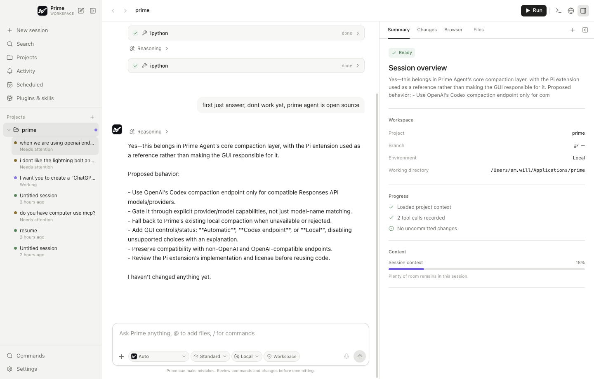

# Prime Work

Prime Work is a macOS desktop workspace for [Prime Agent](https://github.com/PrimeIntellect-ai/prime-agent). It pairs a native-feeling three-pane interface with Prime Agent's real RPC runtime: projects and persistent sessions on the left, the agent transcript and composer in the center, and Summary, Git Changes, Browser, or Files on the right. A real project-scoped PTY is available as a bottom drawer.



## Features

- Real Prime Agent sessions discovered from `~/.prime/agent/sessions/*.jsonl`
- One isolated `prime-agent --mode rpc` child per active desktop runtime
- Streaming Markdown/GFM, reasoning, tool calls/results, abort, follow-up, resume, and session rename/archive/restore
- Persisted multi-folder projects, bounded workspace file trees, and display-only projects inferred from Prime sessions
- Git status, diffs, stage/unstage, guarded restore, commit, and surfaced command failures
- Isolated in-app browser with navigation, history, annotations, and external-browser handoff
- Project-scoped `node-pty` terminal with clear, maximize/restore, resize, and clean shutdown
- Skills, extensions, prompts, packages, redacted MCP discovery, and explicit MCP endpoint/command configuration
- Project-local `ask_user` extension with multiple-choice dialogs in Prime Work and Prime Agent's native CLI UI
- Agent-backed schedules, activity filters, command palette, settings, light/dark/system themes
- macOS keyboard navigation, responsive panel overlays, reduced motion, and accessible labels/focus states

## Requirements

- Apple Silicon macOS
- Node.js 22.12.0 or newer and npm 10.9.0 or newer
- Prime Agent installed on `PATH` (Homebrew installations at `/opt/homebrew/bin/prime-agent` are detected)
- A configured Prime Agent provider/login

Verify the harness before launching:

```bash
prime-agent --version
prime-agent model list
prime-agent
# Use /login in the Prime Agent CLI when authentication is required.
```

Prime Work never stores provider API keys. Authentication remains owned by Prime Agent.

### Ask the user from an agent turn

This repository includes `.prime/agent/extensions/ask-user.ts`. Prime Agent auto-discovers it when the working directory is this project, so the model can call `ask_user` from either Prime Work or the interactive Prime Agent CLI. Prime Work renders the request as a native modal; the CLI uses its terminal selector. Non-interactive modes such as print/JSON do not have a question UI. To make the tool available in every CLI project, copy the extension to `~/.prime/agent/extensions/`.

## Develop

```bash
npm install
npm run dev
```

`node-pty` is a native dependency. If a local Python lacks the build tooling used by Electron rebuild, use a Python environment that provides it:

```bash
export npm_config_python=/path/to/python3
npm install --ignore-scripts
npx electron-builder install-app-deps
```

## Quality gates

```bash
npm run typecheck       # Node and renderer TypeScript
npm test                # 33 backend, protocol, security, shutdown, and Git tests
npm run test:e2e        # production build + Playwright Electron smoke suite
npm run build           # main, CommonJS preload, and renderer bundles
```

The twelve Electron smoke tests verify the sandboxed bridge, service-backed boot, primary pages, command palette, modal focus containment, dark mode, keyboard suggestions, extension-question round trips, optimistic setting rollback, compact overlays, resizable panes, isolated browser guest, real PTY, terminal maximize/restore, and macOS last-window recreation.

## Build for macOS

```bash
npm run package:mac
```

Artifacts are written to `release/` as an arm64 `.app`, DMG, and ZIP. Only the `node-pty` native binary and spawn helper are unpacked from ASAR and rebuilt for the bundled Electron ABI.

Electron Builder uses an available signing identity automatically. Public distribution additionally requires Apple notarization credentials supported by Electron Builder (Apple ID/app-specific password/team ID or App Store Connect API key). A locally signed but unnotarized build will be rejected by Gatekeeper on another Mac; this repository does not contain release credentials.

## Keyboard shortcuts

| Shortcut | Action |
|---|---|
| `⌘N` | New session |
| `⌘K` | Command palette/search |
| `⌘B` | Toggle project sidebar |
| `⌘J` | Toggle terminal |
| `⌘,` | Settings |
| `Esc` | Close the active palette/modal/overlay |

## Data and security

Prime session/auth/config files remain authoritative. Prime Work stores only UI settings, project bookmarks, and local archive metadata in Electron's application data directory. It does not rewrite session JSONL. The packaged renderer is served from a secure custom `prime-work://` scheme rather than privileged `file://`. Remote pages run in a dedicated `persist:prime-work-browser` partition with Node disabled, no preload, denied permissions, denied popups, and HTTP(S)-only navigation. Renderer IPC is context-isolated, allowlisted, main-frame checked, and path validated.

Prime Agent tools, extensions, skills, packages, and terminals run with your macOS user permissions. Review projects, commands, and third-party packages before running them. See [`docs/security.md`](docs/security.md) for the complete trust boundary.

## Current scope

Prime Work targets the local Prime Agent workflow. Local worktree/cloud environment creation, voice dictation, file-picker attachments, and multi-terminal split layouts are intentionally not presented as functional controls. Schedules require a live Prime runtime. Browser annotations are kept for the current inspector session rather than written into remote pages.

## Design provenance

The interaction model was researched from publicly available ChatGPT/Codex Work documentation and screenshots, then implemented with original Prime naming, iconography, colors, and code. See [`docs/reference-sources.md`](docs/reference-sources.md).
