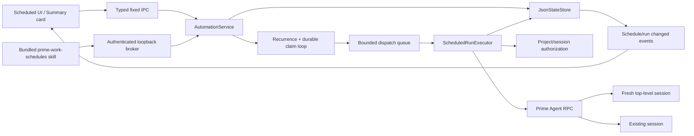

# Plan: Scheduling Tool, Thread Heartbeats, and Agent-Created Automations

**Generated**: 2026-08-06  
**Estimated Complexity**: High

## Overview

Build one Prime Work-owned automation control plane instead of stretching Prime Agent's native cron/heartbeat APIs beyond their semantics.

The key split is:

- **Project task** → every run creates a separate top-level Prime Agent session in the selected, explicitly authorized project.
- **Thread task** → every run returns to the selected existing session and appears as a user-visible thread automation/heartbeat.
- **Prime Agent user heartbeat** → retain as the native singleton `/heartbeat` primitive.
- **Prime Agent RLM heartbeat** → retain for short-lived, agent-internal coordination; do not reinterpret it as a durable project automation.

Prime Work owns durable task definitions, RFC 5545 recurrence calculation, run history, target authorization, model/reasoning/speed configuration, and dispatch. A bundled Python skill talks to a narrow authenticated local broker API so an agent can create and manage tasks without a confirmation step. Prime Agent remains authoritative for transcripts and sessions; Prime Work never writes session JSONL.

This is intentionally a **background-broker MVP**, not an OS service: Prime Work must be running. Closing the last window may leave the broker alive when active tasks exist; explicit Quit stops scheduling. On restart, missed occurrences are recorded as skipped and are never replayed in a burst.

## Confirmed Product Decisions

1. Every project-scoped recurring run creates a separate top-level session.
2. MVP requires Prime Work/background broker to be running and must expose missed/skipped runs.
3. A thread may have multiple user-visible session schedules.
4. An agent may create/manage schedules without a confirmation dialog.
5. Speed is Prime Work's existing Normal/Fast priority service-tier choice.
6. Every task target is a persisted Prime Work project or a session contained by one; projectless/folderless targets are invalid.

## Research Conclusions

### What Prime Work has today

- `src/pages/ScheduledPage.tsx` offers four fixed schedule strings and a prompt.
- `ScheduleRecord` in `src/types/api.ts` has no target, timezone, recurrence structure, execution profile, revision, or history.
- `electron/main/settings-schedules.ts` forwards `add_schedule`/`cancel_schedule` to a live runtime. Prime Work is only a thin client over Prime Agent's session-owned scheduler.
- Creation requires a live runtime; fallback-listed tasks can lose their owner and become uncancellable.
- The page cannot edit, pause/resume, run now, open a task, inspect runs, or link a result session.
- The catalog is stale after bootstrap unless Prime Work itself mutates it.

### Native Prime Agent boundaries

Prime Agent 0.7.0 has three related but distinct primitives:

| Primitive | Cardinality | Target/run behavior | Suitable role |
|---|---:|---|---|
| User `/heartbeat` | One per active session | Re-enters the same session | Native visible heartbeat compatibility |
| `rlm_heartbeat` | Multiple per active session | Re-enters the same session; agent-owned | Internal polling and long-running coordination |
| General schedule | Multiple per active session | Re-enters the same session | Legacy session schedules |

All three persist jobs under the owning session's artifacts and target an existing session. None creates a fresh top-level session per tick. Native schedules also lack per-job model, reasoning, Fast, IANA timezone, edit/run history, and RFC 5545 recurrence semantics. Prime Agent's cron evaluator uses the worker's local timezone.

Therefore:

- A Prime Agent plugin is **not** the right owner for the scheduler.
- A scheduled prompt that tells its agent to shell out and start another agent is a fragile controller-session hack and should not be used.
- A Prime Work main-process scheduler is required for correct project/fresh-session behavior.
- A bundled skill plus authenticated broker endpoint is sufficient for agent control; no Prime Agent fork is required for the MVP.

### Reference behavior

The current ChatGPT Scheduled documentation confirms the useful reference semantics: standalone tasks start a new chat per run; in-chat tasks reuse chat context; custom schedules may use RFC 5545 RRULE; local project tasks require the machine and desktop app to remain running; and tasks can select default or explicit model/reasoning. Source: <https://learn.chatgpt.com/docs/automations> (read through `markdown.new`).

## Target Architecture



### Ownership rules

- **Prime Work owns:** task definitions, recurrence, next-run calculation, task revisions, run summaries, dispatch claims, and agent-facing schedule API.
- **Prime Agent owns:** session/runtime lifecycle, transcript JSONL, model execution, and native heartbeat artifacts.
- **Renderer owns no authority:** it submits typed IDs/specs; main resolves and validates every target and capability again.
- **Agent skill owns no persistence:** it calls the same service as the GUI through a capability-scoped local endpoint.

## Domain Model

Add a versioned, typed model in `src/types/api.ts` (or a shared `src/types/schedules.ts` re-exported from it):

```ts
type ScheduleTarget =
  | { kind: 'project'; projectId: string }
  | { kind: 'session'; projectId: string; sessionId: string }

type ScheduleTiming =
  | { kind: 'once'; at: string }
  | {
      kind: 'rrule'
      dtstartLocal: string
      timeZone: string
      rrule: string
    }

type ScheduleModel =
  | { kind: 'auto' }
  | { kind: 'pinned'; key: string }

type ScheduleExecution = {
  model: ScheduleModel
  thinking: 'auto' | PrimeThinkingLevel
  speed: 'normal' | 'fast'
}

type ScheduleDefinitionStatus =
  | 'active'
  | 'paused'
  | 'completed'
  | 'blocked'

type ScheduleRunStatus =
  | 'queued'
  | 'running'
  | 'succeeded'
  | 'failed'
  | 'skipped'
  | 'interrupted'

interface ScheduledTask {
  schemaVersion: 1
  id: string
  revision: number
  title: string
  prompt: string
  target: ScheduleTarget
  timing: ScheduleTiming
  execution: ScheduleExecution
  status: ScheduleDefinitionStatus
  createdBy: 'user' | 'agent'
  createdAt: string
  updatedAt: string
  nextRunAt?: string
  blockedReason?: string
}

interface ScheduledRun {
  id: string
  taskId: string
  taskRevision: number
  trigger: 'scheduled' | 'manual'
  scheduledFor: string
  queuedAt: string
  startedAt?: string
  finishedAt?: string
  status: ScheduleRunStatus
  executionSnapshot: ScheduleExecution
  sessionId?: string
  sessionFile?: string
  error?: string
  skippedCount?: number
}
```

### Modeling policies

- Persist project/session IDs, not renderer-supplied paths as authority.
- Resolve IDs to current records and canonical paths at dispatch time.
- Store `nextRunAt` only as a derived cache validated against the recurrence.
- Increment `revision` on every material edit. An in-flight run keeps its captured revision/config.
- Definition status and last-run outcome are independent. A failed run does not terminate a recurring task.
- Keep a bounded history (recommended: 50 runs per task and 2,000 globally); retain linked session IDs/files only as references.
- Soft-delete/cancel definitions so run history remains inspectable.

## Recurrence and Time Semantics

Use RFC 5545 RRULE as the canonical recurring representation and add `rrule@2.8.1` for parsing/iteration. Keep `DTSTART` and IANA `timeZone` separate and canonical. One-time tasks store a future ISO instant.

The editor maps friendly controls to RRULE:

- minutes/hours (`FREQ=MINUTELY|HOURLY;INTERVAL=n`)
- daily
- weekdays shortcut
- weekly with multiple weekdays and interval
- monthly by day-of-month or ordinal weekday
- optional count/until
- advanced raw RRULE disclosure

Required policies:

- Default timezone is the device IANA timezone at creation, saved with the task.
- Preserve local wall-clock intent across timezone-offset changes.
- Run once in a repeated local hour.
- Skip an invalid spring-forward local occurrence rather than moving it silently.
- Minimum recurring interval: one minute.
- On broker restart/wake, aggregate all past occurrences into one `skipped` run with `skippedCount`; calculate the next future occurrence. Never backfill a burst.
- Display a natural-language summary and the next three concrete occurrences before save.
- Validate RRULE bounds (length, frequency, count/until horizon, iteration cap) to prevent CPU or storage abuse.

## Dispatch Semantics

### Durable claim loop

Add a main-process `AutomationScheduler` with one timer for the nearest due task.

1. Atomically claim a due `(taskId, revision, scheduledFor)` through `JsonStateStore.update`.
2. Advance/persist the next occurrence before starting external work.
3. Enqueue a `ScheduledRun` with an idempotency key.
4. Dispatch through a bounded queue (recommended: two background runs globally, one per target).
5. Persist terminal outcome and emit a typed change event.
6. On crash/restart, convert stale `running` claims to `interrupted`; do not replay them.

Coalesce overlapping/missed ticks for the same task. A manual Run now creates its own run without changing `nextRunAt`.

### Project target

- Re-resolve and authorize the stored project ID at run time.
- Start a new isolated RPC runtime with `cwd` and no `sessionPath`.
- Apply the captured model/thinking/Fast profile.
- Send the prompt, wait for terminal completion, set a useful session name, capture its session ID/file, then detach/stop the RPC client cleanly.
- Add the resulting top-level session link to run history.
- Never attach the background runtime to the renderer's active workspace.

This should be implemented through a dedicated background runner or a purpose-tagged runtime, not by reusing React's `sendPrompt` path. Extract common validated launch logic from `AgentRpcManager` rather than duplicating argv/environment construction.

### Session target

- Re-resolve the session ID, verify it remains under the stored authorized project, and validate the canonical JSONL path through `SessionService`.
- Serialize by canonical session path.
- If Prime Work owns an idle matching runtime, use it under an execution lock.
- Otherwise resume the session in a background RPC runtime.
- If another client owns the session lease, wait/coalesce until exclusive delivery is possible; surface `Waiting for thread` rather than silently inheriting the wrong execution profile.
- Apply pinned model/thinking/Fast immediately before the prompt. Capture and restore an interactive runtime's prior profile only if its configuration revision has not changed concurrently.
- `auto` means inherit the thread's current/default model and reasoning at dispatch. Pinned means strict.
- If Fast or a pinned capability is unavailable at dispatch, mark the task blocked/failed with an actionable reason; never silently downgrade.

Do not use `SessionService.followUp` for a pinned profile because it cannot atomically apply model/reasoning/Fast. It remains an optimization only for fully inherited execution.

## Heartbeat Coexistence

Use distinct user-facing terminology and data sources:

- **Thread schedule / thread heartbeat:** Prime Work-owned durable automation; multiple per thread; full custom recurrence, edit, Run now, model/reasoning/Fast, history.
- **User heartbeat:** Prime Agent-native singleton created with `/heartbeat`.
- **Agent heartbeat:** Prime Agent-native `rlm_heartbeat`, multiple, intended for internal coordination.

Implementation rules:

1. Preserve `source` when normalizing native jobs. Stop the current `ScheduleService` from presenting heartbeat/RLM jobs as generic schedules.
2. Add a typed native heartbeat catalog using `list_heartbeats`, `get_heartbeat`, `set_heartbeat`, `update_heartbeat`, and `manage_heartbeat`.
3. Show native heartbeats in the active thread's Summary with source badges. User heartbeat supports its native management actions; RLM heartbeats support pause/resume/stop but remain agent-managed for instruction edits.
4. Show Prime Work thread schedules first and make them fully openable/editable/runnable.
5. Teach the scheduling skill: use `rlm_heartbeat` for temporary internal polling; use `prime_work_schedules` when the user asks for a durable visible scheduled task or a fresh project session.
6. Treat existing native `source:'cron'` jobs as legacy thread schedules. Keep them visible and cancellable; offer explicit migration rather than auto-migrating and risking duplicate runs.

## Agent-Facing Capability

### Bundled Python skill

Ship a Python-backed `prime-work-schedules` skill as an app resource and load it explicitly for Prime Work-started agents. It should appear in **Plugins & skills** as a built-in enabled capability.

Suggested methods:

```python
await prime_work_schedules.list(target="current")
await prime_work_schedules.create_once(...)
await prime_work_schedules.create_recurring(...)
await prime_work_schedules.update(task_id, ...)
await prime_work_schedules.pause(task_id)
await prime_work_schedules.resume(task_id)
await prime_work_schedules.run_now(task_id)
await prime_work_schedules.delete(task_id)
```

Creation accepts either a future ISO timestamp or RRULE + IANA timezone, plus title, prompt, target (`current_project` or `current_session`), model, thinking, and Fast. The skill returns a compact task record and a deep-link ID.

### Local broker security

- Bind an ephemeral loopback server; do not expose a renderer channel or dynamic IPC.
- Issue a random bearer capability per Prime Work runtime through its sanitized child environment.
- Reject browser-originated requests and missing/invalid tokens.
- Capability scope is the runtime's current explicitly granted project and, when present, its current session.
- Allow the agent to list/manage tasks only in that scope. It may create without user confirmation, per the confirmed decision.
- Accept IDs and typed specs only; never let the skill choose an arbitrary filesystem path or executable.
- Enforce request/body/field/task-count/rate limits and constant-time token checks.
- Expire the token when the runtime stops.
- All mutations call `AutomationService`; the broker never writes state directly.

### GUI feedback

Agent-created tasks do not require confirmation, but they must not be invisible:

- refresh the schedule catalog immediately from a main-process event
- show a non-blocking toast with **View task** and **Undo**
- label `createdBy: agent` in task details/history
- render a schedule-specific result card when a transcript/tool result can be correlated
- include the built-in skill and its enabled state in Plugins & skills

## UX Specification

### Editor

Replace the narrow fixed-option modal with a wide responsive editor/sheet:

1. **Task** — title (optional/derived) and durable prompt.
2. **Run in** — `New session in project` or `Continue an existing session`, with project/session pickers. No generic target.
3. **When** — Once/Recurring, friendly custom controls, timezone, optional end, advanced RRULE.
4. **Run with** — Model, Reasoning, Normal/Fast using the existing provider catalog/capability rules.
5. **Review** — natural summary and next three occurrences.

Defaults:

- launched from a session: current thread target
- launched elsewhere with a current project: fresh session in that project
- model/reasoning: Auto, clearly documented as dispatch-time resolution
- speed: Normal

### Scheduled page

- Filters: Active, Paused, Needs attention, All.
- Whole rows open details.
- Row metadata: target kind/name, cadence + timezone, next run, last-run outcome, created-by badge.
- Persistent keyboard/touch-safe overflow actions; do not rely on hover opacity.
- Detail view: Run now, Edit, Pause/Resume, Delete, prompt, target, recurrence, execution profile, run history.
- Run links open the new project session or the existing thread/message context.
- Keep dirty forms on failure; version/request-ID every mutation so stale refreshes cannot overwrite newer state.

### Thread Summary

Add an **Automations** section to `SummaryPanel`:

- list up to two Prime Work thread schedules and native heartbeats for the active session
- show source, status, title, cadence, next run
- clicking switches to Scheduled and opens the task detail
- provide `View all` for additional items
- never show project-scoped tasks in a thread summary

### Responsive/accessibility

- Use fieldset/legend and real radio/checkbox controls for scope and weekday selection.
- Associate errors/help with controls; use `role=status` for previews and `role=alert` only for failures.
- Preserve the existing focus trap/focus restore; Escape must not silently discard a dirty editor.
- At narrow widths, use a full-height single-column sheet with sticky header/footer and 44px targets.
- Always show row actions on coarse pointers; honor reduced motion.

## Sprint 1: Typed Domain and Recurrence Engine

**Goal**: Persist and validate rich automation definitions without executing them.

**Demo/Validation**:
- Service tests create once/weekly/monthly/advanced tasks and survive restart.
- The next-three preview is correct in multiple IANA zones and DST boundaries.
- Invalid/missing project/session targets are rejected or blocked.

### Task 1.1: Introduce schedule domain types
- **Location**: `src/types/api.ts` or new `src/types/schedules.ts`
- **Description**: Add target/timing/execution/task/run/catalog/input/result types and bounded status enums.
- **Dependencies**: None.
- **Acceptance Criteria**: Projectless targets are unrepresentable; definition and run status are separate.
- **Validation**: Typecheck plus pure type/validation tests.

### Task 1.2: Add state migration and bounded persistence
- **Location**: `electron/main/store.ts`, `tests/backend/store.test.ts`
- **Description**: Bump/migrate desktop state; persist definitions and bounded run summaries through `JsonStateStore.update`.
- **Dependencies**: 1.1.
- **Acceptance Criteria**: v1 state upgrades losslessly; corrupt entries are dropped individually; state remains owner-only and atomic.
- **Validation**: Migration, corruption, concurrent-update, and history-pruning tests.

### Task 1.3: Implement recurrence parser/iterator
- **Location**: new `electron/main/schedules/recurrence.ts`, `package.json`, lockfile, unit tests
- **Description**: Canonicalize RRULE/one-time timing, calculate previews/next run, enforce bounds and DST/missed policies.
- **Dependencies**: 1.1.
- **Acceptance Criteria**: No unbounded iteration; timezone semantics match the documented policy.
- **Validation**: Table tests for hourly/daily/weekday/monthly/count/until, leap dates, repeated/missing hours, and hostile rules.

### Task 1.4: Implement CRUD-only AutomationService
- **Location**: new `electron/main/schedules/service.ts`, `electron/main/index.ts`
- **Description**: Main-owned list/get/create/update/pause/resume/delete validation with task revisions and target resolution.
- **Dependencies**: 1.1–1.3.
- **Acceptance Criteria**: Every mutation revalidates target IDs; stale revision updates fail.
- **Validation**: Focused backend service tests.

## Sprint 2: Real Editor and Task Management UI

**Goal**: Users can create, inspect, edit, pause/resume, and delete typed tasks, with no execution yet.

**Demo/Validation**:
- Create one project task and multiple thread tasks using custom weekly/monthly/RRULE controls.
- Reload the app and edit the same structured values.
- Summary preview and task detail remain keyboard-accessible at desktop and narrow widths.

### Task 2.1: Add fixed typed IPC/preload surface
- **Location**: `src/types/api.ts`, `electron/preload/index.ts`, `electron/main/ipc.ts`, IPC tests
- **Description**: Expose fixed schedule CRUD/preview channels and schedule-change subscription.
- **Dependencies**: Sprint 1.
- **Acceptance Criteria**: Exact main-frame authorization remains; inputs arrive as `unknown` and are bounded/validated in main.
- **Validation**: IPC authorization/schema/payload-limit tests.

### Task 2.2: Add schedule state hook with race guards
- **Location**: new `src/hooks/useSchedules.ts`, `src/App.tsx`
- **Description**: Own catalog/detail/mutation state, revisions, request IDs, event refresh, and error preservation.
- **Dependencies**: 2.1.
- **Acceptance Criteria**: Late reads cannot overwrite newer mutations; failed saves keep the draft.
- **Validation**: Delayed-promise renderer concurrency tests.

### Task 2.3: Build reusable schedule editor
- **Location**: new `src/components/schedules/ScheduleEditor.tsx`, `RecurrenceEditor.tsx`, `ExecutionProfile.tsx`, shared styles
- **Description**: Implement target, task, custom recurrence/timezone, model/reasoning/Fast, preview, and dirty-close behavior.
- **Dependencies**: 2.1–2.2.
- **Acceptance Criteria**: Uses authorized pickers only; advanced RRULE is validated server-side; unsupported reasoning/Fast is explained.
- **Validation**: jsdom interaction/accessibility tests plus responsive E2E.

### Task 2.4: Replace Scheduled list with list/detail states
- **Location**: `src/pages/ScheduledPage.tsx`, new schedule list/detail/history components, `src/styles/pages.css`, `src/styles/responsive.css`
- **Description**: Add filters, openable rows, detail actions, target/status metadata, and empty/error states.
- **Dependencies**: 2.2–2.3.
- **Acceptance Criteria**: All actions are keyboard/touch reachable and do not rely on hover.
- **Validation**: Frontend tests and visual E2E flow.

## Sprint 3: Durable Scheduler and Fresh Project Sessions

**Goal**: Project tasks run on schedule and Run now, each producing a separately linked top-level session.

**Demo/Validation**:
- Run now twice and observe two top-level sessions in the selected project.
- Trigger a short recurring task and observe bounded run history and exact model/reasoning/Fast settings.
- Quit/restart past a due time and observe a skipped record, not a burst.

### Task 3.1: Add durable due-claim scheduler
- **Location**: new `electron/main/schedules/scheduler.ts`, lifecycle wiring in `electron/main/index.ts`
- **Description**: Single timer, atomic claim/advance, global/per-target admission, coalescing, wake/restart recovery, shutdown drain.
- **Dependencies**: Sprint 1.
- **Acceptance Criteria**: Duplicate timer callbacks cannot duplicate a run; stale running claims become interrupted.
- **Validation**: Fake-clock crash/wake/concurrency/idempotency tests.

### Task 3.2: Extract validated background launch path
- **Location**: `electron/main/agent-rpc/manager.ts`, possible new `electron/main/agent-rpc/launcher.ts` and `scheduled-runner.ts`
- **Description**: Reuse cwd/model/thinking/Fast validation, add runtime purpose/isolation, wait-for-idle/result, and strict Fast verification.
- **Dependencies**: 3.1.
- **Acceptance Criteria**: Background runtimes never attach to the active renderer workspace and remain within existing process/concurrency limits.
- **Validation**: Manager/runner tests with fake RPC executable.

### Task 3.3: Execute project runs
- **Location**: new `electron/main/schedules/executor.ts`, provider/project/session service integration
- **Description**: Reauthorize project, start fresh runtime, prompt, title session, capture result link, persist terminal outcome.
- **Dependencies**: 3.2.
- **Acceptance Criteria**: Every run has a distinct session ID/file; project removal/identity change blocks dispatch.
- **Validation**: Backend integration and hermetic Electron E2E.

### Task 3.4: Add run notifications and deep links
- **Location**: schedule events, `src/App.tsx`, Scheduled detail/history
- **Description**: Live catalog/history updates, open-result action, important failure/success notification when window is hidden.
- **Dependencies**: 3.3.
- **Acceptance Criteria**: Deep links select the correct authorized project/session; stale links fail safely.
- **Validation**: Event ownership and navigation tests.

## Sprint 4: Existing-Thread Execution and Heartbeat Summary

**Goal**: Multiple thread schedules safely continue an existing session and appear in its Summary alongside native heartbeats.

**Demo/Validation**:
- Create two schedules for one thread, run both serially with distinct profiles, and open them from Summary.
- Observe waiting/coalescing while the thread is busy.
- Native user/RLM heartbeats no longer leak into generic legacy schedules and display with correct source/actions.

### Task 4.1: Add per-session execution locks/profile revisions
- **Location**: schedule executor, `AgentRpcManager`, provider state handling
- **Description**: Serialize by canonical session path, wait for idle/lease, apply captured profile, conditionally restore interactive profile.
- **Dependencies**: Sprint 3.
- **Acceptance Criteria**: No two writers resume one JSONL; no silent model/Fast downgrade; user profile changes win over restoration.
- **Validation**: Busy-runtime, external-lease, profile-race, and coalescing tests.

### Task 4.2: Execute session runs
- **Location**: `electron/main/schedules/executor.ts`, `electron/main/sessions.ts`
- **Description**: Resolve/authorize session target, deliver inherited or pinned execution, capture message/run result without creating a new top-level session.
- **Dependencies**: 4.1.
- **Acceptance Criteria**: Result lands only in the intended session; missing/archived/unauthorized sessions block safely.
- **Validation**: Hermetic integration tests.

### Task 4.3: Add source-aware native heartbeat service
- **Location**: split/refactor `electron/main/settings-schedules.ts`, new heartbeat types/service, command schema/IPC/preload/tests
- **Description**: Preserve native job source/target fields, separate general schedules from user/RLM heartbeats, expose native management actions.
- **Dependencies**: None after Sprint 1; parallel with 4.1–4.2.
- **Acceptance Criteria**: User singleton and agent-multiple semantics remain intact; no source is misclassified.
- **Validation**: Normalization, catalog scoping, management, and resident-worker tests.

### Task 4.4: Add Summary Automations section
- **Location**: `src/components/Inspector.tsx`, `src/components/inspector/SummaryPanel.tsx`, `src/App.tsx`, styles/tests
- **Description**: Show active-session thread schedules and native heartbeats with deep links and View all.
- **Dependencies**: 4.2–4.3.
- **Acceptance Criteria**: Project tasks never appear; stale schedule/session events cannot populate the wrong workspace generation.
- **Validation**: Workspace-switch and Summary interaction tests.

## Sprint 5: Agent-Created Scheduling Skill

**Goal**: Prime Work agents can autonomously create/manage durable project or thread tasks, and the GUI updates immediately without confirmation.

**Demo/Validation**:
- Ask an agent to schedule a thread follow-up; observe the task appear in Summary/Scheduled without a modal.
- Ask for a recurring fresh-project task with explicit model/reasoning/Fast; observe independently created sessions.
- Verify a token from one project cannot target another project/session.

### Task 5.1: Build capability-scoped broker
- **Location**: new `electron/main/schedules/agent-bridge.ts`, lifecycle wiring/security tests
- **Description**: Ephemeral loopback listener, bearer claims, fixed methods, validation/rate/body limits, runtime token lifecycle.
- **Dependencies**: Sprint 2 CRUD APIs.
- **Acceptance Criteria**: No renderer/browser access; no arbitrary paths; expired/cross-scope tokens fail.
- **Validation**: Adversarial HTTP/auth/scope/rate tests.

### Task 5.2: Ship Python-backed skill
- **Location**: `assets/skills/prime-work-schedules/{SKILL.md,pyproject.toml,src/prime_work_schedules/__init__.py}`, packaging config
- **Description**: Implement typed async client methods and concise durable-vs-RLM routing guidance.
- **Dependencies**: 5.1.
- **Acceptance Criteria**: Loads in dev and packaged app; uses Python stdlib/client only; errors are actionable and bounded.
- **Validation**: Standalone skill test, fresh-agent load test, packaged-resource test.

### Task 5.3: Inject capability and surface skill in GUI
- **Location**: agent launch options/environment, `electron/main/plugins.ts`, Plugins page, renderer events/toasts
- **Description**: Load bundled skill explicitly, issue runtime-scoped token, display enabled capability, show View/Undo feedback.
- **Dependencies**: 5.1–5.2.
- **Acceptance Criteria**: Agent mutations need no confirmation but are immediately visible and attributable.
- **Validation**: E2E create/update/delete from a fake skill client and GUI feedback checks.

### Task 5.4: Add agent schedule API contract tests
- **Location**: backend and E2E suites
- **Description**: Cover once/RRULE validation, current target mapping, model/reasoning/Fast, task limits, no-project rejection, and concurrent agent/UI edits.
- **Dependencies**: 5.3.
- **Acceptance Criteria**: Same service behavior regardless of GUI or skill origin.
- **Validation**: Full focused test matrix.

## Sprint 6: Background Lifecycle, Legacy Migration, and Release Hardening

**Goal**: Make active schedules understandable and reliable across window close, explicit quit, upgrades, and legacy native jobs.

**Demo/Validation**:
- Close the last window with an active task and verify the broker continues according to platform UX.
- Explicitly quit, miss occurrences, restart, and see skipped history.
- Inspect/migrate/cancel a legacy native schedule without duplicate execution.

### Task 6.1: Add broker lifecycle UX
- **Location**: `electron/main/index.ts`, platform tray/menu handling, settings/status UI
- **Description**: Keep broker alive with active tasks, reopen window from app/tray, warn on explicit quit, stop admission and drain safely.
- **Dependencies**: Sprint 3.
- **Acceptance Criteria**: No hidden immortal process after explicit quit; active schedules clearly say this-device/broker-required.
- **Validation**: macOS/window-close E2E plus unit-tested platform decisions.

### Task 6.2: Handle legacy Prime Agent jobs
- **Location**: legacy schedule adapter/service, Scheduled detail UI
- **Description**: Source-aware display, correct owner resolution, cancel, and explicit import/migration workflow.
- **Dependencies**: 4.3.
- **Acceptance Criteria**: No automatic duplicate jobs; ownerless legacy jobs fail with actionable recovery.
- **Validation**: Mixed runtime/CLI catalog tests and migration E2E.

### Task 6.3: Add operational limits and diagnostics
- **Location**: AutomationService/Scheduler, Settings or Scheduled diagnostics
- **Description**: Cap tasks, histories, request rates, queued runs, recurrence work, prompt/title sizes; show last scheduler error and broker state.
- **Dependencies**: All prior backend work.
- **Acceptance Criteria**: Hostile/high-frequency tasks cannot exhaust timers, memory, processes, or disk.
- **Validation**: Load/stress/bounds tests.

### Task 6.4: Documentation and release verification
- **Location**: `README.md`, `docs/security.md`, development/release docs, E2E
- **Description**: Document semantics, app-running requirement, permissions, heartbeat distinction, skill API, missed-run behavior, and rollback.
- **Dependencies**: All prior tasks.
- **Acceptance Criteria**: `npm run typecheck`, `npm test`, `npm run test:e2e`, and production build pass.
- **Validation**: Full release verification.

## Testing Strategy

### Pure/unit

- RRULE canonicalization and next occurrence previews.
- IANA timezone and DST gap/repeat policy.
- missed-run aggregation, revisioning, coalescing, idempotent claims.
- status derivation and bounded history pruning.
- source-aware native heartbeat normalization.
- renderer reducers/request-ID race handling.

### Backend/security

- Every IPC/broker input treated as `unknown`, unknown keys rejected, fields bounded.
- project/session IDs re-resolved and authorized at create and run time.
- folder identity changes/removal block before process launch.
- no direct Prime session-file writes.
- fixed executable + argv, sanitized environment, bounded output/time/process counts.
- broker origin/token/scope/rate/body protections.
- per-session writer lock and shutdown TERM/KILL cleanup.

### Frontend

- custom editor paths: once, interval, weekday, monthly, advanced RRULE.
- invalid timezone/rule and capability errors retain draft.
- whole-row detail, Run now, pause/resume/delete, linked run history.
- Summary task scoping during rapid workspace switches.
- keyboard/focus/labels/live regions and coarse-pointer actions.

### Hermetic E2E

Extend the fake Prime Agent to model:

- unique session creation per background project run
- resume of exact existing session
- model/thinking/service-tier state
- busy/leased session behavior
- native user + RLM heartbeat catalogs
- agent skill/broker mutation
- app window close/background run and explicit quit/restart skip

## Potential Risks and Mitigations

1. **Same-session configuration races**  
   Mitigation: per-session lock, idle wait, profile revision, strict pinned semantics, conditional restoration.

2. **Duplicate runs after sleep/crash**  
   Mitigation: persist claim and advance next occurrence before dispatch; idempotency key; interrupted-not-replayed recovery.

3. **Agent can schedule too aggressively without confirmation**  
   Mitigation: current-target capability scope, one-minute minimum, task/rate/concurrency caps, visible toast/history, immediate Undo.

4. **Timezone/DST surprises**  
   Mitigation: saved IANA zone, next-three preview, explicit gap/repeat policy, fixture tests across zones.

5. **Background runtimes pollute interactive workspace ownership**  
   Mitigation: purpose-tagged/separate runner and never include background runtimes in renderer matching.

6. **Native and Prime Work schedules duplicate or conflict**  
   Mitigation: source-aware catalogs, explicit legacy labels and migration, no automatic import.

7. **Fast mode silently falls back today**  
   Mitigation: strict scheduled-run verification of returned service tier; block/fail rather than misrepresent.

8. **Broker disappears on non-macOS window close**  
   Mitigation: platform tray/background lifecycle whenever active tasks exist; explicit Quit remains authoritative.

9. **Frequent state rewrites grow expensive**  
   Mitigation: bounded run history, batched updates where safe, measured stress tests before introducing a separate store.

10. **Packaged skill path/install differs from development**  
    Mitigation: package it as an explicit resource, resolve paths centrally, and test both unpackaged and packaged launch.

## Rejected Alternatives

- **Use native Prime Agent schedule for everything:** cannot create a fresh top-level session each run or honor the full recurrence/execution profile.
- **Treat every thread task as `/heartbeat`:** native user heartbeat is singleton, conflicting with multiple visible schedules per thread.
- **Use RLM heartbeats as user tasks:** they are agent-owned/internal and have different management/residency semantics.
- **Have a scheduled controller agent shell out to `prime-agent`:** hides failure/ownership in another transcript and makes session/run history unreliable.
- **Write `scheduled-jobs.json` or session JSONL directly:** violates Prime Agent authority and lease/security boundaries.
- **Install an OS service in MVP:** contradicts the selected app/broker-running scope and adds platform installer/security complexity too early.

## Rollback Plan

- Gate the new scheduler behind a persisted feature version until Sprints 1–4 are stable.
- Keep legacy native schedule listing/cancel code during migration; do not delete native jobs automatically.
- On rollback, stop Prime Work-owned timers and broker admission, preserve task definitions/history as inert data, and leave Prime Agent sessions untouched.
- Remove/disable the bundled skill by launch configuration without modifying user/global skills.
- State migration must retain an original-version backup or tolerate unknown schedule fields so downgrading does not corrupt existing desktop settings/projects.
